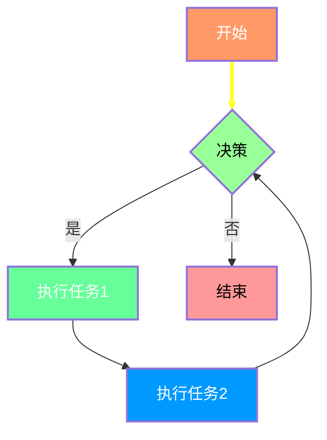
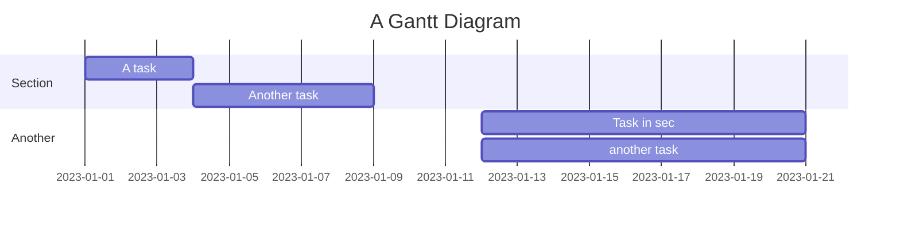
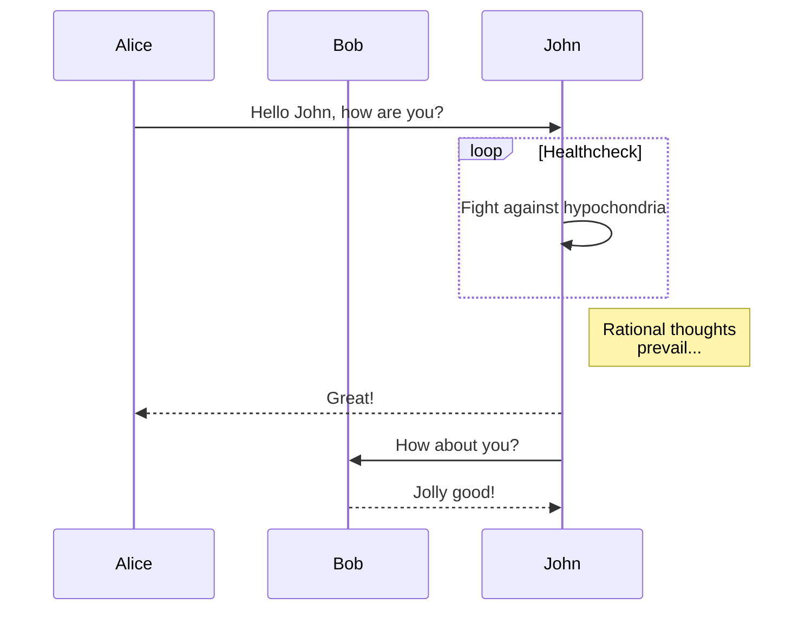
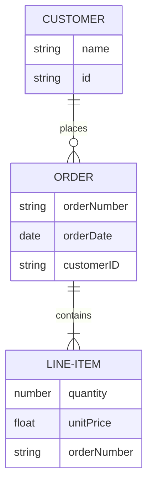

---  
title: VitePress适配Mermaid经验记录
filename: 20250220
tags:  
  - VitePress  
  - Mermaid
  - Markdown
categories:  
  - 技术分享
date: 2025-02-20
description: VitePress适配Mermaid经验记录
articleGPT: 在尝试将Mermaid图表集成到VitePress项目中，我经历了安装依赖、配置VitePress和解决集成问题三个阶段。首先，在package.json中添加了vitepress-plugin-mermaid插件，并通过npm和pnpm命令安装。然而，安装后并未立即起作用。经过查阅相关issue，我对VitePress配置文件进行了修改，启用了Mermaid插件，并解决了Markdown集成问题。最终，在我的努力下，VitePress成功支持了Mermaid图表功能，为文档站点增色不少。这次经验让我深刻体会到解决问题的喜悦和成就感。
top:   
share: true  
delete: false  
cover: https://blog.rz15.cn/wp-content/uploads/2025/02/Snipaste_2025-02-19_20-45-36.png
---  


# VitePress适配Mermaid经验记录

在尝试将Mermaid图表支持引入到我的VitePress项目中，我经历了以下步骤和解决方案。

## 步骤 1: 安装依赖

首先，我需要确保安装了`vitepress-plugin-mermaid`插件。

1. 在`package.json`中添加了如下依赖项：

    ```json
    "devDependencies": {
        "vitepress-plugin-mermaid": "^版本号"
    }
    ```

2. 使用以下命令安装插件及其依赖：

    ```bash
    npm install
    pnpm install
    ```

    这将更新`package-lock.json`和`pnpm-lock.yaml`文件。

## 步骤 2: 配置VitePress

安装完成后，我发现插件并未按预期工作。经过一番搜索，我在GitHub的[这个issue](https://github.com/emersonbottero/vitepress-plugin-mermaid/issues/78)中找到了解决方案。

1. 修改`.vitepress/config.mjs`文件，加入了以下内容：

    ```javascript
    import { withMermaid, MermaidPlugin } from "vitepress-plugin-mermaid";

    export default defineConfig({
      title: 'VitePress',
      vite: {
        plugins: [MermaidPlugin()],
        optimizeDeps: {
          include: ['mermaid'],
        },
        ssr: {
          noExternal: ['mermaid'],
        },
      },
    });
    ```

2. 接着，我还需要修改`.vitepress/theme/utils/markdownConfig.mjs`文件，以便Mermaid能够与Markdown集成：

    ```javascript
    import { MermaidMarkdown, MermaidPlugin } from 'vitepress-plugin-mermaid';

    // 在markdown配置中使用MermaidMarkdown
    md.use(MermaidMarkdown);
    ```

完成这些修改后，我的VitePress项目最终成功支持了Mermaid图表。

## 总结

通过以上步骤，我学会了如何将Mermaid集成到VitePress中，并且解决了一些初装后不起作用的问题。希望这份记录对其他人有所帮助。

## 展示

下面是一个Mermaid图表的示例：







